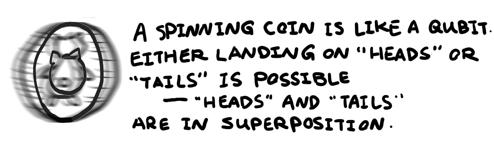
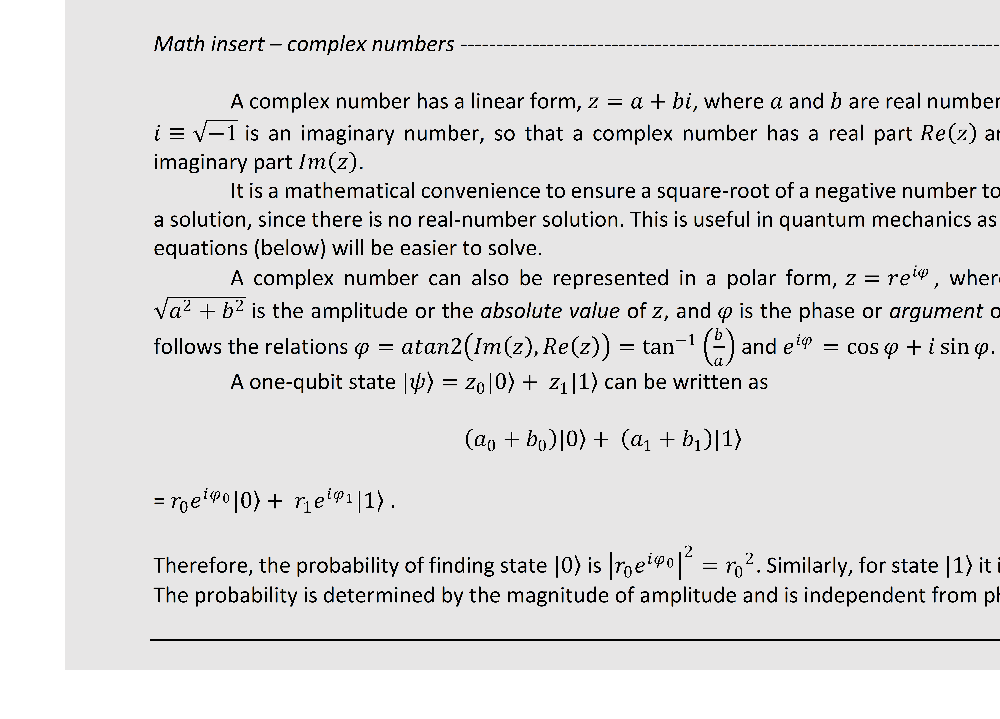
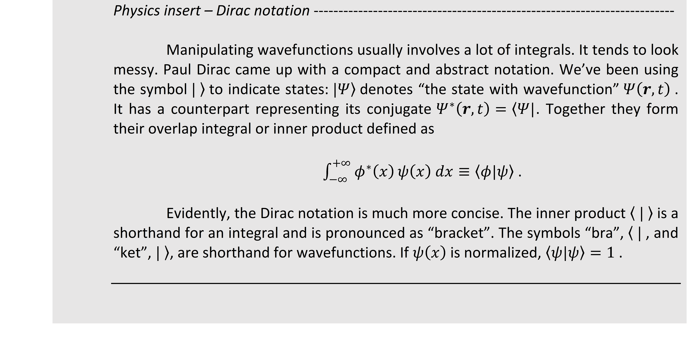

## 1.1 States

* [Vector notation]()
* [Classical bits]()
* [Quantum bits – qubits]()   
* [Superposition]()   
* [2-Norm approach]()
    * [Q# exercise: setup a Q# environment]()

### Vector notation

In physics, one describes the "condition" of a system as a "state". It may be understood as an indicator of
a system's status – is a switch "off" or "on"; is the temperature in a room "low" or "high"; is a light "red"
or "green", is a flipped coin "tail" or "head", etc. A state of a system does not necessarily need to be binary.
But these examples are chosen conveniently to be binary because historically computers are built on
binary systems. Mathematically, these states can be represented with two numbers: 0 and 1.


We denote a state with symbol | ⟩ (pronounced as "ket"; see _Physics insert - Dirac notation_ in section
1.2.4). With two numbers, one can write the two states using two [basis vectors](https://en.wikipedia.org/wiki/Basis_(linear_algebra)) as

 ,  . 

This is the definition of |0⟩ and |1⟩ states. Note that the 0 and 1 in | ⟩ have a different meaning from the
ones in the vectors. We could give non-numerical labels to the states, such as  , , etc.

### Classical bits

|0⟩ and |1⟩ states above are two single classical bits. We can represent multi-bit states with vectors as well. Multi-bit states are [Kronecker products](https://en.wikipedia.org/wiki/Kronecker_product) of single bits. For example, state |00⟩ has two bits, both being 0. We obtain |00⟩ by doing a Kronecker product of two |0⟩ states, denoted as |0⟩⊗|0⟩ (see how to do Kronecker product in _Math insert - Kronecker product_ ). This yields

 .

Similarly,

 ,

 ,

 .

As can be seen, a complete set of two bits is represented with four basis vectors, each with four elements. When a system has N bits, we will need 2N basis vectors each with 2N elements to describe it.


### Quantum bits – qubits

It turns out that |0⟩ and |1⟩ are just two special cases in quantum computing. Generally, when there is
one qubit, the system can be in a state  that has some portions of both |0⟩ and |1⟩ states in it.
Mathematically,  is a linear combination or **superposition** of |0⟩ and |1⟩, i.e.

 , 

where  and  are two constants and can be complex numbers (see _Math insert – complex numbers_).  and  are essentially describing how much of |0⟩ and |1⟩ are in the system. They are the "weights" and in
fact amplitudes (see "wavefunction") of the |0⟩ and |1⟩ states. Their magnitude squared,  and  ,
give the probabilities of finding the system in |0⟩ and |1⟩, respectively. Therefore  and  can be
anything as long as the total probably sums up to 1, that is . This is referred to as the
normalization condition.



When the system has two qubits, there are four basis states the system can be in, where


The normalization condition writes as . With N qubits, there are 
possible states the system can be in.



### Superposition

In math, superposition is just several functions linearly adding up as in eq. (6 & 7). Here, we are dealing with states – one type of mathematical functions. Superposition of states is the fundamental factor that makes quantum computing powerful. Because while a classical bit can only be in either |0⟩ or |1⟩, a qubit can be in a state where |0⟩ and |1⟩ coexist – a complex linear combination between |0⟩ and |1⟩. Thus, if we make a computing system that can leverage this quantum phenomenon, we can have a single qubit that contains information where two classical bits would be needed. With N qubits, the system can compute 2N classical bits of information.





### 2-Norm approach – an alternative way to teach and learn quantum mechanics

Now that we are in the 21st century, quantum phenomena are no longer so strange to physicists, given all the knowledge we have accumulated from the past experiments. Perhaps there is a more straightforward way to learn quantum mechanics, without needing to immediately think about wavefunctions. Scott Aaronson, a theoretical computer scientist at University of Texas, uses a different approach to introduce quantum mechanics: https://www.scottaaronson.com/democritus/lec9.html

Essentially, we can start by generalizing probability theory. In our experience, probabilities are
always positive and sum to 1. This is called the "1-norm" condition:

 .

In quantum mechanics, we don't work directly with probabilities. Instead, we work with
"amplitudes." The square of an amplitude is a probability, so we require that _squares_ of the amplitudes sum to 1. This is called the "2-norm" condition (where "2" refers to the fact that we're squaring the amplitudes):

 .

One thing to note here is that when we talk about "squaring" a number, we actually mean taking
the "modulus squared" (or the "square of the magnitude"), which is done by multiplying it by its complex conjugate: . For a real number, taking the modulus squared and taking the square are the same thing, but for a complex number, they're different.

Because of the 2-norm condition, an amplitude can be a positive, negative or even complex
number. In the examples earlier, we wrote the amplitudes as . As seen in the normalization condition, it is the square of _magnitudes_ of the amplitudes that sum to 1. Amplitudes are related to probabilities. If
we want to go from an amplitude to a probability, we take the square of the magnitude of the amplitude. That's why the squares of the amplitudes must sum to 1.

The complex number  can be written as , with  being the magnitude and  the phase (see earlier _Math insert – complex numbers_ ). Both  and  are real numbers. As we've seen in _Math insert – complex numbers_ , probability only depends on the magnitude of the amplitude. For two
amplitudes, the normalization condition is

 .

This alternative quantum mechanics introduction bypasses wavefunction derivations. It puts up
front that the universe behaves according to the 2-norm condition with a set of axioms. This allows us to see some fundamental quantum mechanical behaviors without dealing with more complicated systems, such as particles in an external potential. This is a useful fact when we talk about **measurements** in the next session.

```
To read more rigorous mathematical derivations of the axioms in modern quantum theory:
```
- https://arxiv.org/abs/quant-ph/
- https://arxiv.org/abs/1011.
- https://arxiv.org/abs/quant-ph/

### Q# exercise: setup a Q# environment


Q# is a domain-specific programming language, developed by Microsoft, used for expressing quantum
algorithms. We will be using it to gain hands-on experience programming quantum computers. There are
several ways to exercise programming in Q#. The Microsoft Quantum Development Kit provides several
open-source options. In this tutorial book, we will be choosing exercises developed on VS Code, Jupyter Notebooks and other tools. At the end of each session, we will familiarize ourselves by using a couple of these tools and hands-on coding. (The goal of the below exercise is to set up the environment and to take note of the katas, rather than to run a Q# program at the moment.)

1. Install and validate [Quantum Development Kit](https://docs.microsoft.com/en-us/quantum/install-guide/?view=qsharp-preview) (choose between Visual Studio or Visual Studio
    Code) according to the instructions 
2. Download and clone Microsoft Quantum Developer Kit Samples and Libraries
3. Download QuantumComputingViaQSharpSolution developed by Pavan Kumar.
4. Look at the first script in 01_HelloQuantumWorld Operation.qs in Visual Studio (Code).
5. Take a look at the Quantum Katas developed on Jupyter Notebook. We will choose from these
    katas after learning the concepts at each session. You can run the katas online as a Jupyter
    Notebook. If you wish to run them locally, follow the instructions on the section labeled
    'Running the Katas Locally' to clone the repository onto your computer.