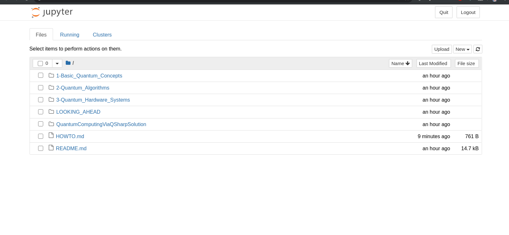
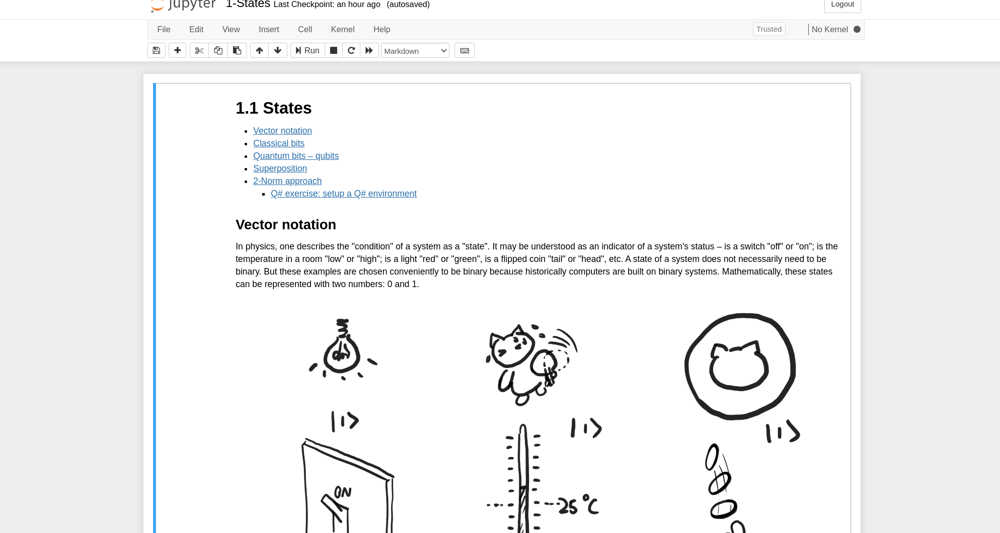

# How to read this book


**Installing Jupyter Notebook to optimize working with this repo**

While using _Reference Guide for Quantum Computing, a Microsoft Garage project_ you might notice some discrepancies in rendering equations in different IDEs and on GitHub. For a smooth experience, use Jupyter Notebooks [online](https://nbviewer.jupyter.org/github/microsoft/Reference-Guide-For-Quantum-Computing-A-Microsoft-Garage-Project) or locally, following the below instructions:

## Requirements:

Operating system: Windows 10, Linux, MacOS

Runtime: Python 3.3+


## Installing Jupyter with pip

Before you install jupyter with pip, make sure you are on the newest version of [pip](https://pip.pypa.io/en/stable/installing/).

```pip3 install --upgrade pip```

To install the Jupyter Notebook use the following command

```pip3 install jupyter```

For an always current installation guide of Jupyter Notebook follow the official instructions. (https://jupyter.readthedocs.io/en/latest/install.html)

Now clone the community_book GitHub repository.

```git clone git@github.com:KittyYeungQ/community_book.git```

From the command line navigate to the cloned community_book folder via

```cd ~/path/to/community_book/```

To run the notebook use

```jupyter notebook```
**Kitty**: this did not work for me, had to use ```python -m notebook```

Jupyter Notebook should run at localhost:8888. Usually the browser opens this url automatically.



Now you can open every chapter by navigating through the folder structures.

